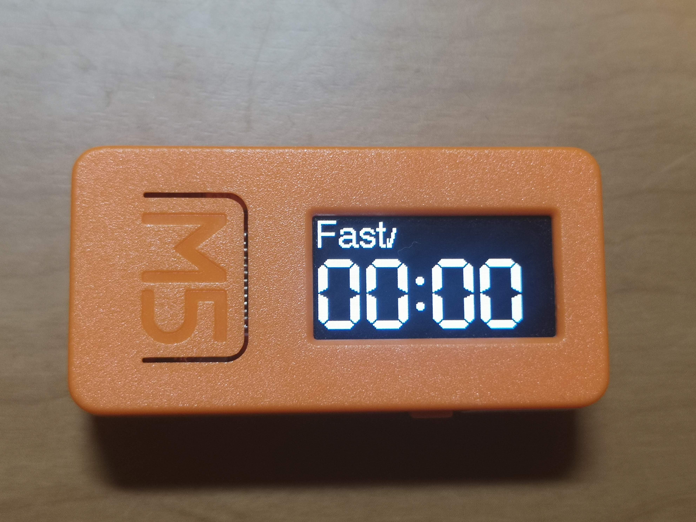

# walking_timer

インターバル速歩のためのタイマーアプリ for M5StickC

## 操作方法

- 開始/一時停止
  - M5ボタン
- リセット
  - 右側ボタン

## インターバル速歩とは

早歩きとゆっくり歩きを３分ずつ交互に繰り返すこと。

- [全身の持久力が高まるウォーキング法！インターバル速歩とは？ - NHK健康チャンネル](https://www.nhk.or.jp/kenko/atc_13.html)
- [5カ月で体力が2割UP　「インターバル速歩」に挑戦 - NIKKEI STYLE](https://style.nikkei.com/article/DGXKZO58441220U0A420C2W11300/)
